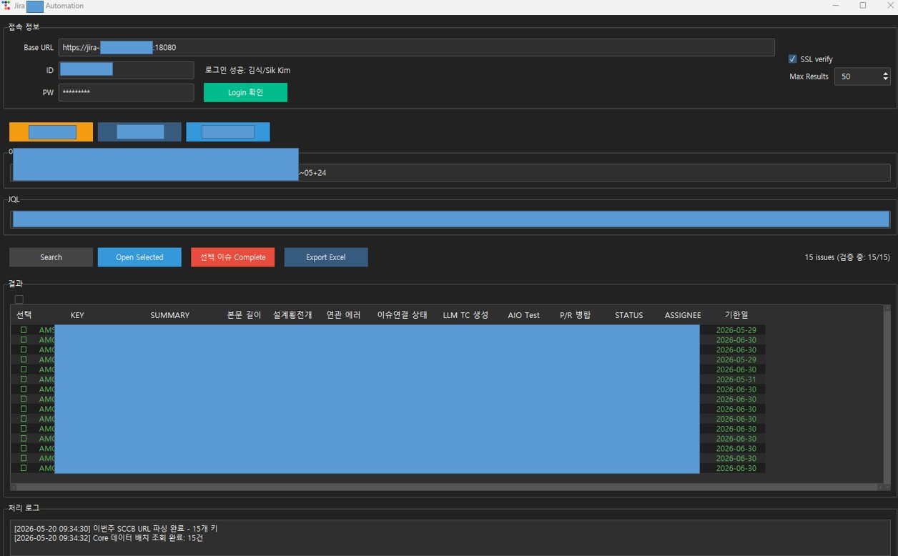

# Jira 이슈 처리 Automation

JIRA 프로젝트의 SW 변경점 관리 이슈들의 검증 및 자동 완료 처리 도구입니다.

Jira 이슈를 일괄 조회하고, SW변경 필수 필드(진행 상태, 해결책, End Date 등)를 자동으로 세팅하여 이슈를 Complete 처리합니다.

---

## 실행 화면



---

## 주요 기능

### 1. Jira 로그인 및 접속 설정
- Base URL, ID/PW 입력 후 **Login 확인** 버튼으로 연결 상태를 즉시 검증합니다.
- SSL verify 옵션 및 최대 조회 건수(Max Results) 설정을 지원합니다.
- `Enter` 키로도 로그인 확인이 가능합니다.

### 2. 3가지 조회 모드 (프리셋 JQL)
| 버튼 | 모드 | 설명 |
|------|------|------|
| **SW 변경 미대상** | `not_target` | SW 변경 상태 = "미 대상" 이슈 조회 |
| **SW 변경 대상** | `target` | SW 변경 상태가 비어있거나 완료/사전완료 이슈 조회 |
| **VOC 완료처리** | `voc_complete` | 이번주 SW 변경 URL에서 이슈 키를 파싱하여 연결된 SW_VOC 이슈를 일괄 완료 처리 |

JQL을 직접 수정하여 커스텀 검색도 가능합니다.

### 3. 이슈 결과 그리드
조회된 이슈를 아래 컬럼으로 한눈에 표시합니다:

| 컬럼 | 설명 |
|------|------|
| KEY | Jira 이슈 키 |
| SUMMARY | 이슈 제목 |
| 본문 길이 | 이슈 본문 글자 수 |
| 설계횡전개 | 설계횡전개 여부 |
| 연관 에러 | 에러 테이블 존재 여부 |
| 이슈연결 상태 | 연결된 이슈 현황 |
| LLM TC 생성 | AI 기반 TC 생성 상태 |
| AIO Test | AIO 테스트 결과 |
| P/R 병합 | Pull Request 병합 여부 |
| STATUS | 현재 Jira 상태 |
| ASSIGNEE | 담당자 |
| 기한일 | Due Date |

- **컬럼 헤더 클릭**: 오름/내림차순 정렬
- **전체 선택 체크박스**: 상단 체크박스로 전체 선택/해제

### 4. 선택 이슈 Complete 자동 처리
선택한 이슈에 대해 Jira Transition을 자동 실행합니다:
- SW 변경 상태 → `SW 변경 완료` 자동 세팅
- 해결책 → `완료` 자동 세팅
- End Date → 오늘 날짜(Asia/Seoul 기준) 자동 세팅
- Transition 탐색: `완료` / `Done` / Done 카테고리 순서로 자동 매칭

**VOC 완료처리 모드**에서는 부모 이슈에 연결된 SW_VOC 이슈를 자동으로 탐색하여 일괄 처리합니다.

### 5. Open Selected
선택한 이슈를 브라우저에서 바로 열어 확인할 수 있습니다.

### 6. Export Excel
조회된 이슈 목록을 `.xlsx` 파일로 내보냅니다. 헤더 스타일 및 컬럼 너비가 자동으로 설정됩니다.

### 7. 처리 로그
화면 하단의 로그 창에서 처리 결과(성공/실패, 건수, 오류 메시지)를 실시간으로 확인할 수 있습니다.

---

## 설치 및 실행

### 요구 사항
- Python 3.10 이상
- Windows 또는 Linux

### 설치
```bash
pip install -r requirements.txt
```

### 실행
```bash
python -m sccb_app.app
```

---

## 설정 메모

| 항목 | 값 |
|------|----|
| 기본 Base URL | `https://jira-stms.semes.com:18080` |
| End Date API 형식 | `YYYY-MM-DD` (하이픈 고정) |
| SW 변경 상태 값 | `SW 변경 완료` |
| 해결책 값 | `완료` |
| 타임존 | `Asia/Seoul` |

---

## 프로젝트 구조

```
JIRA_Automation/
├── sccb_app/
│   ├── app.py          # 진입점
│   ├── ui.py           # tkinter/ttkbootstrap UI
│   ├── jira_client.py  # Jira REST API 클라이언트
│   └── workflow.py     # Transition 처리 워크플로우
├── requirements.txt
├── DEBUG_GUIDE.md
└── docs/
    └── screenshot.png
```
